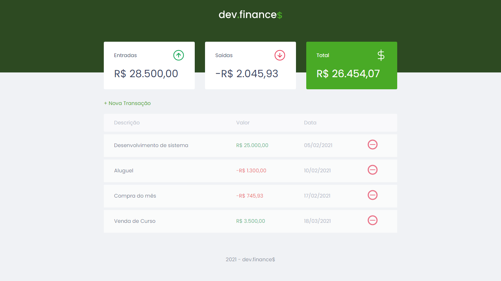

<h1 align="center">
    <strong>Maratona Discover – <a target="_blank" rel="noreferrer noopener" href="https://rocketseat.com.br/">Rocketseat</a> 🚀</strong>
</h1>

A [Maratona Discover][maratona-discover] é um evento realizado pela [@Rocketseat](https://github.com/rocketseat-education), em que é revisado e praticado o conteúdo da trilha **Discover** disponível através do link [app.rocketseat.com.br/discover][trilha-discover].

  <a href="#-sobre"><strong>Sobre</strong></a>&nbsp;&nbsp;&nbsp;|&nbsp;&nbsp;&nbsp;
  <a href="#-tecnologias"><strong>Tecnologias</strong></a>&nbsp;&nbsp;&nbsp;|&nbsp;&nbsp;&nbsp;
  <a href="#-licença"><strong>Licença</strong></a>

## ✏️ Sobre

Nesta 1ª edição da maratona, foi proposto e desenvolvido o **dev.finances$**.

O dev.finances$ é uma aplicação de controle financeiro, em que é possível cadastrar e excluir transações e ver o saldo de entrada e saída.

Os dados de entrada e saída da aplicação são armazenados no **Local Storage** do navegador.
 

    

---

    

## 💻 Tecnologias

Este projeto foi desenvolvido utilizando as seguintes tecnologias:

* [HTML][html]
* [CSS][css]
* [JavaScript][js]

## 📃 Licença

O repositório está sob a licença [MIT][mit]. Consulte o arquivo [LICENSE](https://github.com/bryan-lima/maratona-discover-rocketseat/blob/master/LICENSE) para obter mais detalhes.

[maratona-discover]: https://maratonadiscover.rocketseat.com.br/inscricao
[trilha-discover]: https://app.rocketseat.com.br/discover
[html]: https://html.spec.whatwg.org/
[css]: https://www.w3.org/Style/CSS/
[js]: https://developer.mozilla.org/en-US/docs/Web/JavaScript
[mit]: https://opensource.org/licenses/MIT
